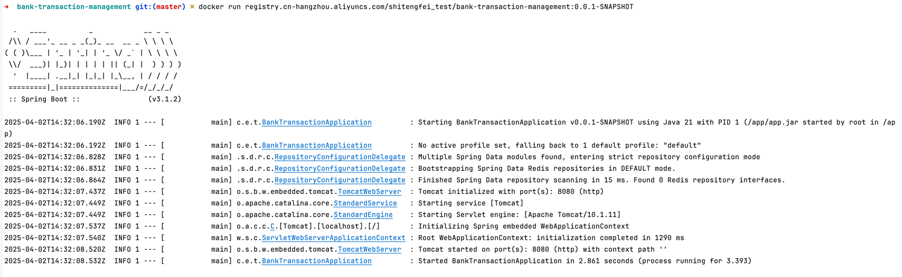
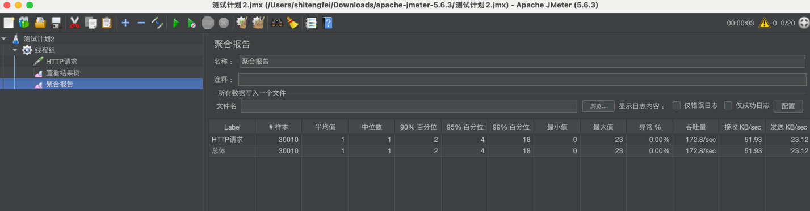

# 银行交易管理系统

## 项目简介
本项目是一个基于 Spring Boot 的银行交易管理系统，用于处理银行交易的创建、查询、更新和删除操作。系统提供了 RESTful API 接口，方便与其他系统进行集成。

## 功能特性
1. **交易管理**：支持创建、查询、更新和删除交易记录。
2. **分页查询**：支持对交易列表进行分页查询，提高查询效率。
3. **异常处理**：通过自定义异常类和全局异常处理器，对创建重复交易、删除不存在交易等异常情况进行了统一处理，增强了系统的健壮性。
4. **容器化支持**：支持使用 Docker 进行容器化部署，方便在不同环境中运行。
5. **缓存机制**：使用 Spring Cache 和 Redis 实现了缓存机制，提高了系统性能，需要启动启动本地127.0.01:6379本地redis缓存。

## 技术栈
- **后端**：Spring Boot、Spring Web、Spring Cache、Spring Data Redis
- **测试**：JUnit、Spring Boot Test
- **容器化**：Docker

## 项目主要代码结构bank-transaction/
初步设计，实际以项目为准，未更新
```angular2html
├── src
│   ├── main
│   │   ├── java
│   │   │   └── com
│   │   │       └── example
│   │   │           └── banktransaction
│   │   │               ├── BankTransactionApplication.java
│   │   │               ├── controller
│   │   │               │   └── TransactionController.java
│   │   │               ├── handler
│   │   │               │   └── GlobalExceptionHandler.java
│   │   │               ├── model
│   │   │               │   └── Transaction.java
│   │   │               ├── repository
│   │   │               │   └── TransactionRepository.java
│   │   │               └── service
│   │   │                   └── TransactionService.java
│   │   └── resources
│   │       └── application.properties
│   └── test
│       ├── java
│       │   └── com
│       │       └── example
│       │           └── banktransaction
│       │               ├── controller
│       │               │   └── TransactionControllerTest.java
│       │               └── integration
│       │                   └── TransactionIntegrationTest.java
└── pom.xml
└── README.md
```
## 外部库说明
- `spring-boot-starter-web`：用于构建 RESTful API，处理 HTTP 请求和响应。
- `spring-boot-starter-cache`：用于实现缓存机制。
- `spring-boot-starter-data-redis`：用于与 Redis 缓存进行交互。
- `spring-boot-starter-test`：用于编写和运行单元测试和集成测试。

## 运行项目

### 1. 克隆项目git clone https://github.com/your-repo/bank-transaction.git
cd bank-transaction
### 2. 构建项目mvn clean package
### 3. 运行项目java -jar target/bank-transaction-0.0.1-SNAPSHOT.jar
### 4. 运行测试mvn test（待验证）
### 5. 构建 Docker 镜像mvn clean package  dockerfile:build dockerfile:push  -DskipTests
// docker 镜像源配置
```json

{
  "builder": {
    "gc": {
      "defaultKeepStorage": "20GB",
      "enabled": true
    }
  },
  "experimental": false,
  "registry-mirrors": [
    "https://yck71rkr.mirror.aliyuncs.com",
    "https://docker.m.daocloud.io/",
    "https://huecker.io/",
    "https://dockerhub.timeweb.cloud",
    "https://noohub.ru/",
    "https://dockerproxy.com",
    "https://docker.mirrors.ustc.edu.cn",
    "https://docker.nju.edu.cn",
    "https://xx4bwyg2.mirror.aliyuncs.com",
    "http://f1361db2.m.daocloud.io",
    "https://registry.docker-cn.com",
    "http://hub-mirror.c.163.com",
    "https://docker.mirrors.ustc.edu.cn"
  ]
}
```
### 6. 运行 Docker 容器docker run registry.cn-hangzhou.aliyuncs.com/shitengfei_test/bank-transaction-management:0.0.1-SNAPSHOT


## API 文档
### 创建交易
- **URL**：`POST /api/transactions`
- **请求体**：{
    "type": "DEPOSIT",
    "amount": 1000.0
}- **响应体**：{
    "id": "12345678-1234-1234-1234-123456789012",
    "type": "DEPOSIT",
    "amount": 1000.0
}
### 查询交易列表
- **URL**：`GET /api/transactions?page=0&size=10`
- **响应体**：[
    {
        "id": "12345678-1234-1234-1234-123456789012",
        "type": "DEPOSIT",
        "amount": 1000.0
    },
    {
        "id": "23456789-2345-2345-2345-234567890123",
        "type": "WITHDRAWAL",
        "amount": 500.0
    }
]
### 查询单个交易
- **URL**：`GET /api/transactions/{id}`
- **响应体**：{
    "id": "12345678-1234-1234-1234-123456789012",
    "type": "DEPOSIT",
    "amount": 1000.0
}
### 更新交易
- **URL**：`PUT /api/transactions/{id}`
- **请求体**：{
    "id": "12345678-1234-1234-1234-123456789012",
    "type": "WITHDRAWAL",
    "amount": 500.0
}- **响应体**：{
    "id": "12345678-1234-1234-1234-123456789012",
    "type": "WITHDRAWAL",
    "amount": 500.0
}
### 删除交易
- **URL**：`DELETE /api/transactions/{id}`
- **响应体**：无内容，状态码 204

## JMeter 压测文档
### 创建交易接口（`POST /api/transactions`）
| 参数名 | 参数类型 | 是否必传 | 描述 | 示例值 |
| ---- | ---- | ---- | ---- | ---- |
| type | String | 是 | 交易类型，可选值为 `DEPOSIT` 或 `WITHDRAWAL` | `DEPOSIT` |
| amount | Double | 是 | 交易金额 | `1000.0` |

### 查询交易列表接口（`GET /api/transactions/xxx`）
| 参数名 | 参数类型 | 是否必传 | 描述 | 示例值 |
| ---- | ---- | ---- | ---- | ---- |
| page | Integer | 否 | 页码，从 0 开始，默认
### 测试结果
